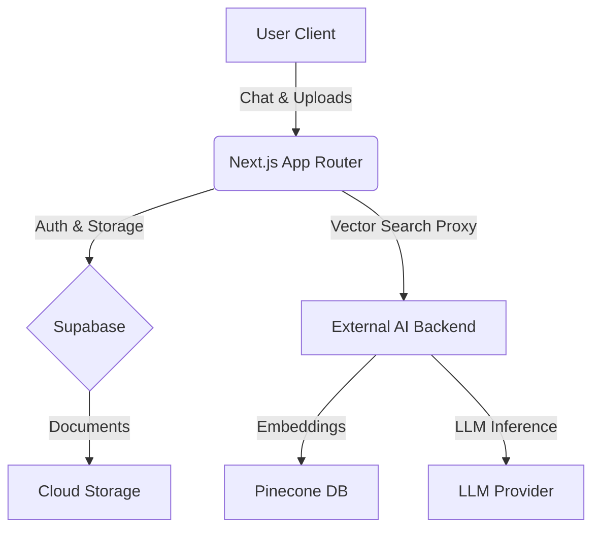

# 🧠 NexaDocs AI 
### *The Next-Gen Document Intelligence Platform*

[](https://nextjs.org/)
[](https://react.dev/)
[](https://supabase.com/)
[](https://tailwindcss.com/)
[](https://www.pinecone.io/)

---

## 🚀 Overview

**NexaDocs AI** is a state-of-the-art **Retrieval-Augmented Generation (RAG)** workspace built for the modern hackathon era. It bridges the gap between static documents and dynamic intelligence, allowing users to **chat with their data** in real-time.

Built with performance and aesthetics in mind, it features a bleeding-edge stack utilizing **Next.js 15**, **React 19**, and **Tailwind CSS 4.0**, delivering a buttery-smooth, glassmorphic user experience.

---

## ✨ Key Features

### 🤖 **Semantic Brain**
-   **Context-Aware Search**: Powered by Pinecone vector embeddings, the system understands *intent*, not just keywords.
-   **AI Chat Interface**: A responsive chat experience that cites its sources.
-   **Source Attribution**: Every answer is backed by real file references. Click a citation to see the truth.

### 📂 **Smart File Ecosystem**
-   **Robust File Preview**: Custom-built previewer handling PDF and DOCX files with ease. 
-   **Intelligent Path Resolution**: Algorithms that auto-detect and resolve file paths even with complex timestamping or folder nesting.
-   **Nested Folders**: Organize your knowledge base with a familiar, file-explorer-like interface.
-   **Multi-Upload Capability**: specialized robust upload pipeline handling massive concurrent file ingestions.

### 🎨 **Premium UX/UI**
-   **Glassmorphism Design**: Modern, translucent UI components that feel alive.
-   **Global Toast System**: A centralized notification hub for graceful error handling and status updates.
-   **Interactive Sidebar**: Fluid navigation between chat history, file management, and results.
-   **Custom Modals**: Goodbye default browser alerts; hello beautiful, animated confirmation dialogs.

### 🔐 **Enterprise-Grade Security**
-   **Supabase Authentication**: Secure session management with JWT and refresh tokens.
-   **Role-Based Access**: Granular permissions (Manager vs User) for sensitive actions like deletions or uploads.
-   **Protected Routes**: Middleware ensured security for all API endpoints.

---

## 🛠️ Technical Architecture



### **The "Zero-Fail" Philosophy**
We implemented failing-safe mechanisms across the app:
-   **Proxy Architecture**: The Next.js frontend acts as a secure orchestrator, proxying complex AI tasks to specialized backend services.
-   **Graceful Degradation**: If a file preview fails, our smart fallback logic searches the directory tree to find the correct file match.

---

## 📸 visual Tour

| **Semantic Search** | **Smart Previews** |
|:---:|:---:|
| *Instant, result-highlighted search across thousands of documents.* | *Seamless, in-app file viewing without breaking flow.* |

| **Interactive Chat** | **Secure & Beautiful** |
|:---:|:---:|
| *DeepContext chat with source citations.* | *Polished auth pages and glassmorphic modals.* |

---

## ⚡ Getting Started

1.  **Clone the Repo**
    ```bash
    git clone https://github.com/your-username/hackatonn.git
    ```

2.  **Install Dependencies**
    ```bash
    npm install
    ```

3.  **Configure Environment**
    Create a `.env.local` file with your Supabase credentials:
    ```env
    NEXT_PUBLIC_SUPABASE_URL=your_url
    NEXT_PUBLIC_SUPABASE_ANON_KEY=your_key
    ```

4.  **Run the Revolution**
    ```bash
    npm run dev
    ```

---

<div align="center">

**Built with ❤️ for the Hackathon**
*Pushing the boundaries of what's possible on the web.*

</div>
